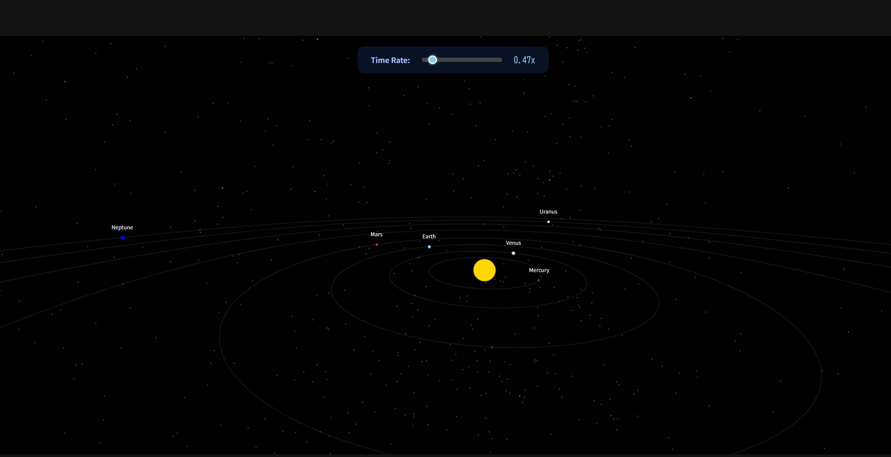

# 🪐 Solar System 3D Visualization

## Project Overview

This is an interactive 3D visualization of our Solar System, built using the **Three.js** library.  
Users can observe the orbital mechanics of the planets, adjust simulation speed, and zoom in on individual planets to view detailed astronomical data.

The application is fully responsive and provides a smooth, engaging educational experience directly in the browser.

**🔗 Live Demo:** [Click to Open Solar System Simulator](https://mohakamran.github.io/solar-system/)

---

## 📸 Preview



---

## ✨ Features

- **Accurate Orbital Simulation:** Planets orbit the Sun according to scaled-down orbital periods.  
- **Time Control:** Slider to accelerate or decelerate the simulation.  
- **Targeted Zoom & Interaction:** Click on any planet to zoom in, focus the camera, and display an information card with key facts.  
- **3D Camera Controls:** Mouse drag to rotate around Sun/planet; mouse wheel or pinch gesture to zoom.  
- **Real-time Data:** Info card shows mass, radius, gravity, orbital distance (AU), and orbital period (Earth days).  
- **Dynamic Labels:** Planet names track the position of 3D meshes in real-time.

---

## 💻 Technologies Used

- **Three.js (r128):** Core 3D JavaScript library for scene, camera, and object rendering.  
- **Vanilla JavaScript (ES6+):** Handles logic, physics, user interactions, and Three.js integration.  
- **HTML5 & CSS3:** Provides structural markup and responsive styling for the control panel and info card.

---

## 🚀 How to Run Locally

Since this is a single, self-contained HTML file, running it locally is simple:

```bash
# Clone the repository
git clone [your-repository-url]
cd solar-system

# Open the file
# Locate `index.html` in the project folder and open it in a modern web browser
